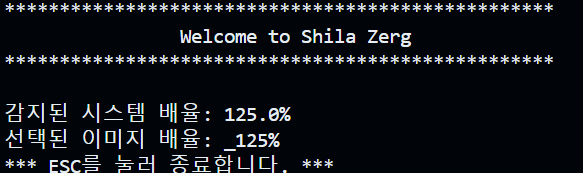
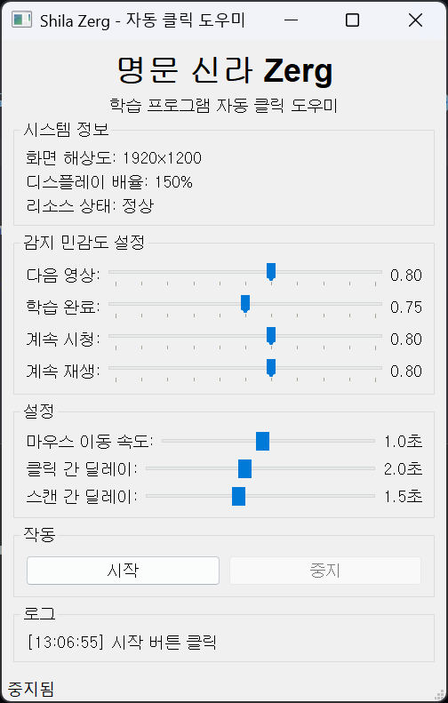

# Zerg
현직 교사 분들의 노고에 있어 연수의 짧은 영상들을 수시로 넘기는 것은 손목에 굉장히 고단한 일입니다.  
Zerg는 이러한 문제를 해결했습니다.  
코드 라이선스는 MIT입니다.  
불필요한 인공지능 사용을 자제하였습니다. 코드의 미학은 불필요함을 덜어내는 것이지요.  

# Usage
* 연수 화면 위치 : 화면이 중앙에 오도록이면 상관 없습니다.

## CLI - Usage

* 끄는 방법 : ESC키를 눌러주세요.

## GUI - Usage

* 알트+탭으로 화면 전환 후 중지 버튼을 눌러주세요.

# Contact  
문제 사항을 수정하고 싶으시다면  
snowypainter@gmail.com 으로 연락처(이메일 등)과 함께 생성된 log 파일을 함께 보내주세요. 문제 상황이 담긴 동영상도 좋습니다. 구체적인 상황을 기록해주세요.